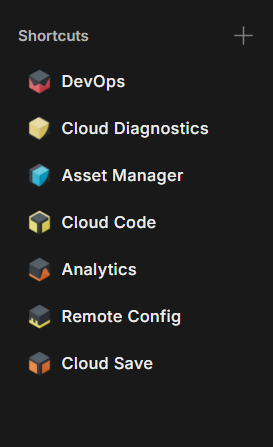
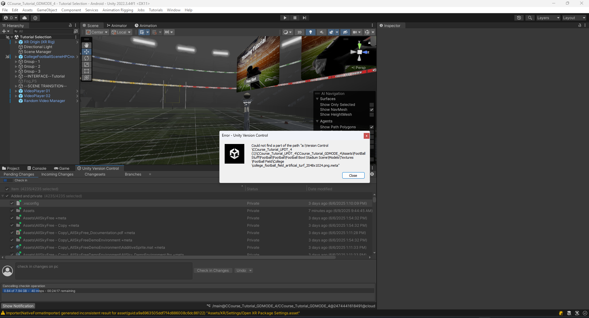

# ☁️ Unity Cloud Services Setup & Guide

> ⚠️ **Editor Compatibility Notice**  
> The ability to follow the steps in this README may vary depending on the version of the Unity Editor being used.  
> Before utilizing this guide, your development team must **agree on a specific Unity version** to ensure consistency and avoid compatibility issues.  
> Features and workflows may differ across versions. This Readme was focused on unity **2022.3.44f1 LTS** and **6000.0.50f1 LTS**

**Author:** Daniel Onyejiekwe  
**Date:** June 2025

This document provides a comprehensive overview and setup guide for Unity Cloud Services, including testing insights, troubleshooting, and best practices. It's written to help Unity developers streamline their workflow using Unity’s integrated cloud tools.

---

## 📌 Table of Contents

- [Overview](#overview)
- [Core Services Explained](#core-services-explained)
- [Setup Instructions](#setup-instructions)
- [Enable Version Control (Step 5)](#-enable-version-control-step-5)
- [Best Practices](#-best-practices)
- [Troubleshooting](#-troubleshooting)
- [Screenshots](#-screenshots)
- [Conclusion](#-conclusion)

---

## 🧠 Overview

Unity Cloud Services offer cloud-based tools to help developers build, deploy, and manage Unity projects with greater efficiency and collaboration. These services include automated builds, cloud saves, version control, and performance analytics.

---

## 🔍 Core Services Explained

### 🚀 Cloud Build  
Unity Cloud Build automates game builds for multiple platforms. After pushing changes to your repository, Unity Cloud compiles your game remotely and notifies you when it’s done.

### 💾 Cloud Save  
Allows developers to store and sync user data (like game progress or settings) to the cloud across multiple devices.

### 🧩 Unity DevOps  
**Version Control (Plastic SCM)** and **Build Automation** enable teams to collaborate in real-time and ship code with confidence.

### 📊 Cloud Diagnostics and Analytics  
Offers real-time insights into player behavior and automated crash reporting.

---

## ⚙️ Setup Instructions

### Step 1: Create Unity Project  
1. Open Unity Hub. 

   

2. Click **New Project**, choose a 2D or 3D template.

   

  *make sure to enable "Use Unity Version Control" as well as "Respository details" and name your project repository*  
3. Name it (e.g., `UnityCloudDemo`) and click **Create**.

### Step 2: Activate Unity Services  
1. In Unity, go to `Window > Services`.  
2. Sign in and create a Project ID if needed.  
3. Enable:  
   - Cloud Build  
   - Cloud Save  
   - Cloud Diagnostics  
   - Analytics  

### Step 3: Configure Cloud Build  
1. Visit [Unity Cloud Dashboard](https://cloud.unity.com/build). 

    

2. Link your Unity project and connect your GitHub/GitLab repo.  
3. Create a build target (e.g., Android, WebGL).  
4. Set build triggers (e.g., on every push to `main`).

### Step 4: Set Up Cloud Save  
1. In Unity, go to `Window > Services > Cloud Save`. 

   (*Beware the current version of Unity in use might change the order of operations in order to complete this process for example in Unity **2022.3.44f1 LTS** services is located in window > general > services*)
2. Enable the service.  
3. Example test code:
   ```csharp
   using Unity.Services.CloudSave;
   await CloudSaveService.Instance.Data.ForceSaveAsync();

## 🔐 Enable Version Control (Step 5)

### (Preferred) Option A: Plastic SCM

**Here is a comprehensive 5 minute starter guide on how to use and what is Unity Version Control (Plastic SCM)**

[](https://www.youtube.com/watch?v=CUdB_otP41Y)

## 🗃️ Getting Started with Unity Version Control

**Here is an official in depth 17 minute guide on how to use Unity Version Control (Plastic SCM)**

[](https://www.youtube.com/watch?v=9IvXupmgl88)

Get an introduction to version control in Unity, how to set up your own repository, invite collaborators, and check in changes. 

Unity Version Control (previously called Plastic SCM) is part of Unity DevOps which provides robust version control and CI/CD solutions in the Unity Cloud, so that you can release more often, catch bugs earlier, try more ideas, and deliver high-quality games. 

Read the Ebook: https://unity.com/resources/best-prac... 

Unity Version Control is available as a part of every Unity subscription. Visit https://unity.com/solutions/version-c... to get started today!

Please note the prices and terms mentioned in the video apply for the time of the recording and may be subject to change. For more info on pricing visit  https://unity.com/products/compare-pl... 

<details>
  <summary>⏱️ Time Stamps (click to expand)</summary>

  - **0:00** – Intro  
  - **0:41** – Project setup  
  - **2:09** – Check in changes  
  - **2:54** – Gluon  
  - **4:50** – Invite team members  
  - **5:53** – Branching strategies  
  - **7:46** – Branches  
  - **9:42** – Handling conflicts  
  - **11:27** – Merge rules  
  - **13:25** – Locking files  
  - **14:55** – Monitor usage  
  - **16:33** – Deleting repositories  

</details>

Correction: The repositories are deleted after 7 days, not 10 days as mentioned in the video.

---
1. Go to **Unity Dashboard > DevOps > Version Control**.

   

2. Create or link an organization.  

   

3. Install the Unity Version Control plugin (Plastic SCM).

---
# 📂 Plastic SCM vs Gluon - Unity Version Control

This section explains the difference between **Plastic SCM** and **Gluon**, the two version control interfaces available through Unity’s Plastic SCM system.

***Note you can search for "Plastic SCM" and "Gluon" in your windows application panel to find these applications on your device after you have installed and enabled Unity Version Control or Plastic SCM from the editor***

---

## 🔍 Overview

Unity offers two interfaces for using version control:

- **Plastic SCM (Full Interface)** – designed for programmers and advanced users
- **Gluon** – designed for artists and non-technical team members

Both tools help you manage changes to your Unity project, but they work differently based on your role and workflow needs.

---

## 🧰 Comparison Table

| Feature | **Plastic SCM (Full Interface)** | **Gluon (Simplified Interface)** |
|--------|----------------------------------|----------------------------------|
| **Target Users** | Developers & advanced users | Artists, designers, non-tech team members |
| **Complexity** | Advanced & powerful | Easy & beginner-friendly |
| **Workflow** | Branch-based, full version control | File-based, simple change tracking |
| **Branching Support** | ✅ Full branching & merging | ❌ Limited (not user-accessible) |
| **Conflict Resolution** | Manual merge tools, full control | Basic auto-merge or overwrite |
| **Partial Checkout** | ✅ Yes (choose specific folders/files) | ✅ Yes (main focus of Gluon) |
| **Interface Style** | Technical UI (like Git clients) | Visual, drag-and-drop UI |
| **Scene Merge** | ✅ Yes (merge scenes with tools) | ⚠️ Not recommended (limited control) |

---

## 🧠 Summary

- **Plastic SCM** is best for:
  - Programmers and technical team members
  - Projects with complex branching, merging, or lots of code
  - Advanced control over version history

- **Gluon** is best for:
  - Artists and designers working on assets
  - Teams that want a simple workflow with fewer conflicts
  - Users who prefer not to deal with branches or merges

---

## ✅ Recommendation

| Role | Recommended Tool |
|------|------------------|
| Programmer | **Plastic SCM** |
| Artist / Designer | **Gluon** |
| Mixed Role | **Plastic SCM** (for full control) |

---

## 📎 Additional Notes

- Both Plastic SCM and Gluon work with Unity projects and can connect to the same cloud repository.
- You can mix usage in the team—developers use Plastic, artists use Gluon—as long as coordination is maintained.

---

Happy collaborating! 🔧🎨

---

### Option B: Git

1. Use your Git provider (e.g., GitHub, GitLab).  
2. Add a `.gitignore` file to exclude the following folders:

    ```
    Library/
    Temp/
    Builds/
    ```

---
## 📤 How to Share a Unity Project with Someone (2025)

**Here is a video on to share a unity project with someone**

   [](https://www.youtube.com/watch?v=GzLKfbch3oU)

---
## 💡 Best Practices

- ✅ Always enable **Collaborators** in your Unity Organization settings.  
- ✅ Use **environment variables** in build scripts for secrets and API keys.  
- ✅ Test **Cloud Save** functionality using development builds first.  
- ✅ Separate build targets for **staging** and **production** environments.  
- ✅ Regularly monitor **Cloud Diagnostics** for crash patterns.
- ✅ **Warning** Uploading large number of files through the web can be risky. The recommended best practice is to limit your web upload to 500 files max with a 20GB limit only. Alternatively, upload using Unity Version Control and then index your files.

---

## 🚀 Recommended Unity Services & Shortcuts

Here's a list of essential Unity services we recommend enabling for cloud-connected and scalable projects. These links go directly to the relevant Unity dashboards or documentation for faster access.

| Tool / Service     | Shortcut / Documentation Link                                                                 | Purpose                                                                 |
|--------------------|--------------------------------------------------------------------------------------------|-------------------------------------------------------------------------|
| 🎒 **Asset Manager**   | [Unity Asset Manager](https://docs.unity.com/en-us/cloud/asset-manager) *(navigate to your project → Assets)* | Manage uploaded assets, textures, models, and more                      |
| ☁️ **Cloud Diagnostics** | [Cloud Diagnostics](https://docs.unity.com/ugs/en-us/manual/cloud-diagnostics/manual/UserReporting/SettingupUserReporting)                    | Track crashes, exceptions, and player issues                            |
| 📈 **Analytics**        | [Unity Analytics Dashboard](https://docs.unity.com/ugs/manual/analytics/manual/overview)                         | Understand player behavior, retention, and in-game metrics              |
| 🧠 **Cloud Code**       | [Cloud Code](https://docs.unity.com/ugs/manual/cloud-code/manual/scripts/getting-started)                                    | Run server-side game logic without managing a backend                   |
| ⚙️ **Remote Config**    | [Remote Config](https://dashboard.unity3d.com/remote-config)                              | Change game settings without pushing new builds                         |
| 💾 **Cloud Save**       | [Cloud Save](https://docs.unity.com/ugs/en-us/manual/cloud-save/manual)                                    | Save and sync player progress across devices                            |

> 🔒 **Tip:** Make sure your Unity project is linked to a Unity organization and that you're signed in to view these services in the dashboard.

*Click the + icon to add shortcuts to any essential unity services*

   

---

## ☁️ 6. Unity Cloud Asset Manager

**Unity Cloud Asset Manager** is a cloud-based service provided by Unity to help teams **centralize, organize, and share game assets** across multiple projects and users. It lives in the Unity Cloud Dashboard and is designed to streamline collaboration between developers, artists, and designers.

---

### 🧾 What Is Unity Cloud Asset Manager?

Unity Cloud Asset Manager is part of Unity's growing suite of **cloud services** designed to support team workflows outside the Unity Editor.

This service allows teams to:

- Store and access assets **in the cloud**
- Maintain a **shared asset library**
- Collaborate on game development by **reusing assets across projects**
- Manage and preview assets without needing the Unity Editor
- Control who has access to each asset or folder (role-based permissions)

You can find it by logging into [Unity Dashboard](https://dashboard.unity3d.com), then navigating to **Asset Manager** under your Organization.

---

### ✅ What Does It Offer?

| Feature | Description |
|--------|-------------|
| 📁 **Cloud Asset Storage** | Securely store your models, textures, prefabs, audio, animations, and more |
| 🧩 **Cross-Project Sharing** | Use assets across multiple Unity projects without duplication |
| 👥 **Team Collaboration** | Designers and developers can upload and retrieve shared assets anytime |
| 🔍 **Search & Tagging** | Filter by name, type, tags, or metadata to quickly find what you need |
| 👀 **In-Browser Previews** | View 2D/3D asset previews and info directly in the Unity Dashboard |
| 🔐 **Permissions Control** | Control who can view, upload, or edit assets at the organization or project level |
| 🌐 **Web-Based Access** | No Unity Editor required to manage assets — access from any browser |

---

### 🚀 How to Use Unity Cloud Asset Manager

1. **Access It**  
   - Visit: [https://dashboard.unity3d.com](https://dashboard.unity3d.com)  
   - Go to your **Organization > Asset Manager**

2. **Upload Assets**  
   - Click **Upload** or drag-and-drop files  
   - Add names, tags, and folders to organize your library

3. **Organize Assets**  
   - Use folders and collections to sort by project, scene, asset type, etc.  
   - Add metadata like asset type, usage rights, or project purpose

4. **Import Assets Into Unity**  
   - Inside Unity, open **Package Manager** and install “Asset Manager” (if needed)  
   - Go to **Window > Asset Manager**  
   - Browse your cloud library and **import assets directly** into your project

---

### 🧠 Why Use Unity Cloud Asset Manager?

- 🚫 No more duplicate assets across team members’ local machines
- ⏱️ Save time by avoiding repeated exports/imports
- 🔄 Build a **shared asset pipeline** that works across projects
- 🔐 Control asset access while collaborating securely
- 🌍 Great for remote or distributed teams working in different Unity versions or setups

---

### 📝 Pro Tip

Use Unity Cloud Asset Manager alongside **Plastic SCM or Gluon** for version control. Plastic handles scene/code collaboration, while Asset Manager centralizes your reusable assets and keeps them accessible across all Unity projects.

---
## 🧯 Troubleshooting

| Issue                     | Solution                                                        |
|---------------------------|-----------------------------------------------------------------|
| Builds not triggering      | Ensure correct Git branch is linked and push includes new changes |
| Cloud Save errors          | Check internet connection and ensure Unity Authentication is enabled |
| Version control conflict   | Use lock rules or communicate with team before overwriting shared assets |
| Cloud Build stuck at “queued” | Free plan may delay builds during peak times                  |
| File/path names being too long to cloud upload | Make sure the file and path name of your unity project is structured well and uses good naming conventions to fix this issue |

***File/path names being to long to cloud upload***

   

## 🖼️ Screenshots


- Unity Dashboard showing Cloud Build targets  

    

- In-Editor Service Panel with Cloud Save enabled   

    

- Cloud Diagnostics console  
  
    

- Sample success build email notification  

   

---

## 💰 Pricing

Unity Cloud Services offer different plans depending on your project's scale and requirements. Here is a general overview:

- **Free Plan**  
  - Limited number of Cloud Build minutes per month  
  - Basic Cloud Save storage quota  
  - Access to core features with usage caps  
  - Suitable for small projects or individual developers  

- **Plus and Pro Plans**  
  - Increased build minutes and storage limits  
  - Priority build queues  
  - Advanced analytics and diagnostics  
  - Access to collaboration features with more users  
  - Ideal for teams and larger projects  

- **Enterprise Plans**  
  - Custom pricing based on scale and support needs  
  - Dedicated support and SLAs  
  - Advanced security and compliance options  

*In the context of Unity's Build Automation service, "build minutes" refer to the time your project spends being processed by Unity's cloud servers during a build. These minutes are used to calculate your billable usage and determine whether you are exceeding any allocated limits.* 

**Note:** Pricing and limits can change; always check the [official Unity Cloud pricing page](https://unity.com/pricing) for the latest details.

Unity Cloud Services pricing varies by plan and usage. Below is an approximate summary:

| Plan        | Cost (USD)          | Cloud Build Minutes     | Cloud Save Storage          | Notes                              |
|-------------|---------------------|------------------------|----------------------------|-----------------------------------|
| **Free**    | $0/month            | 60 build minutes/month | 1 GB storage               | Basic features, ideal for small projects or individual developers |
| **Plus**    | $15/month           | 120 build minutes/month| 5 GB storage               | Priority build queue, more storage, collaboration for small teams |
| **Pro**     | $40/month           | 180 build minutes/month| 20 GB storage              | Advanced analytics, higher quotas, ideal for medium to large teams |
| **Enterprise** | Custom pricing    | Custom                 | Custom                     | Dedicated support, SLAs, compliance, for large-scale production teams |

> **Note:** 
> - Additional build minutes and storage can be purchased as add-ons.  
> - Pricing may vary based on region and contract terms.  
> - Always refer to the official [Unity Pricing Page](https://unity.com/pricing) for the most current info.


# 🎫 What Are Seats in Unity?

A **seat** refers to **a license assigned to one user** — like a “ticket” that gives someone access to Unity’s services and tools under a specific plan (Pro, Plus, Enterprise, etc.).

Think of it this way:

> 🧍‍♂️ One developer working on Unity needs **one seat**.  
> 👨‍👩‍👧‍👦 A team of 5 developers? You need **5 seats** — one for each user.

---

## 🧩 What Does a Seat Include?

When you assign someone a seat, they get:

- Access to the Unity Editor under the paid plan (Pro, Plus, etc.)
- Ability to use cloud services (like Build Automation, Remote Config, etc.)
- Permission to collaborate on Unity projects via version control
- Access to Unity’s dashboards, usage data, and APIs
- License to use certain Unity tools and plugins restricted to the paid tier

---

## 💼 Seat Assignment and Management

- You manage seats through the [Unity Dashboard](https://id.unity.com/organizations).
- Only an **Organization Owner or Manager** can assign/unassign seats.
- Seats can be reassigned to a different user, but **not shared simultaneously**.

---

## 💰 Seat Pricing Example

| **Plan**     | **Monthly Cost per Seat** | **Annual Cost per Seat** | **Notes**                      |
|--------------|----------------------------|----------------------------|--------------------------------|
| Plus         | $15                        | $180                       | One seat per user needed       |
| Pro          | $40                        | $480                       | Same rule — 1 seat = 1 user    |
| Enterprise   | Custom                     | Custom                     | Usually negotiated in bulk     |

> **Example:** A 3-person team using Unity Pro would pay:  
> **3 seats × $40/month = $120/month** or **$1,440/year**

---

## 🛠️ Summary

| **Term**     | **Meaning**                                      |
|--------------|--------------------------------------------------|
| **Seat**     | A license assigned to one team member            |
| **Why it matters** | Determines who can use paid features and cloud tools |
| **1 user = 1 seat** | You cannot share seats simultaneously between users |

---

# 🎮 Unity Team Project - Merging Multiple Scenes

This guide explains how to merge multiple Unity scenes from different team members (in separate projects) into one central Unity project.

---

## ✅ Overview

Each team member has been working on a different scene in their own Unity project. The goal is to combine all scenes into a single Unity project without losing any assets or functionality.

---

## 🔁 1. Choose a Main Project

Designate one Unity project to be the **main/central project** where all scenes and assets will be merged.

---

## 📦 2. Export Scenes from Other Projects

For each teammate's Unity project:

1. Open the Unity project containing your scene.
2. In the **Project window**, locate the folder containing:
   - Your `.unity` scene file
   - Any models, textures, prefabs, scripts used in the scene
3. Right-click the folder ➜ Select **Export Package…**
4. In the export window, check **"Include Dependencies"**
5. Click **Export** and save the `.unitypackage` file

---

## 💻 3. Import Packages into the Main Project

In the main Unity project:

1. Open the project in Unity
2. Right-click in the **Project window** ➜ Select **Import Package > Custom Package…**
3. Choose the `.unitypackage` file from a teammate
4. Import all assets when prompted
5. Repeat for all teammates' scenes

---

## 🧹 4. Organize and Rename

After importing:

- Rename each scene clearly (e.g., `LockerRoom.unity`, `MainMenu.unity`, etc.)
- Store all scenes in `Assets/Scenes/TeamScenes/` or a similar directory

---

## 🔄 5. Scene Navigation (Optional)

To switch between scenes in the game:

Use Unity’s built-in scene manager. Example:

<div style="max-width: 600px; overflow-x: auto;">

<pre><code>
using UnityEngine;
using UnityEngine.SceneManagement;

public class SceneSwitcher : MonoBehaviour
{
    public void LoadScene(string sceneName)
    {
        SceneManager.LoadScene(sceneName);
    }
}
</code></pre>

</div>

---
## 🧾 Conclusion

Unity Cloud Services simplify development workflows by handling builds, syncing data, and managing version control through a unified interface. Based on testing, the setup process is straightforward, but some services may require additional permissions or API calls.