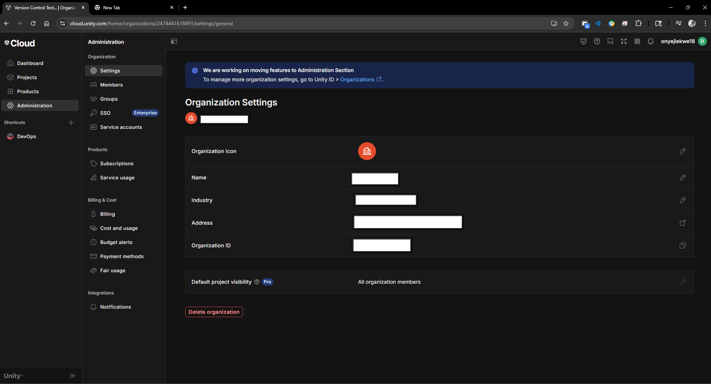
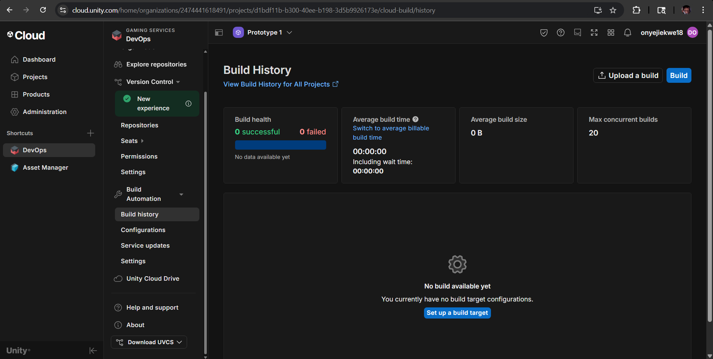

# ☁️ Unity Cloud Services Setup & Guide

> ⚠️ **Editor Compatibility Notice**  
> The ability to follow the steps in this README may vary depending on the version of the Unity Editor being used.  
> Before utilizing this guide, your development team must **agree on a specific Unity version** to ensure consistency and avoid compatibility issues.  
> Features and workflows may differ across versions. This Readme was focused on unity **2022.3.44f1 LTS** and **6000.0.50f1 LTS**

**Author:** Daniel Onyejiekwe  
**Date:** June 2025

This document provides a comprehensive overview and setup guide for Unity Cloud Services, including testing insights, troubleshooting, and best practices. It's written to help Unity developers streamline their workflow using Unity’s integrated cloud tools.

---

## 📌 Table of Contents

- [Overview](#overview)
- [Core Services Explained](#core-services-explained)
- [Setup Instructions](#setup-instructions)
- [Enable Version Control (Step 5)](#-enable-version-control-step-5)
- [Best Practices](#-best-practices)
- [Troubleshooting](#-troubleshooting)
- [Screenshots](#-screenshots)
- [Conclusion](#-conclusion)

---

## 🧠 Overview

Unity Cloud Services offer cloud-based tools to help developers build, deploy, and manage Unity projects with greater efficiency and collaboration. These services include automated builds, cloud saves, version control, and performance analytics.

---

## 🔍 Core Services Explained

### 🚀 Cloud Build  
Unity Cloud Build automates game builds for multiple platforms. After pushing changes to your repository, Unity Cloud compiles your game remotely and notifies you when it’s done.

### 💾 Cloud Save  
Allows developers to store and sync user data (like game progress or settings) to the cloud across multiple devices.

### 🧩 Unity DevOps  
**Version Control (Plastic SCM)** and **Build Automation** enable teams to collaborate in real-time and ship code with confidence.

### 📊 Cloud Diagnostics and Analytics  
Offers real-time insights into player behavior and automated crash reporting.

---

## ⚙️ Setup Instructions

### Step 1: Create Unity Project  
1. Open Unity Hub. 

   

2. Click **New Project**, choose a 2D or 3D template.

   

  *make sure to enable "Use Unity Version Control" as well as "Respository details" and name your project repository*  
3. Name it (e.g., `UnityCloudDemo`) and click **Create**.

### Step 2: Activate Unity Services  
1. In Unity, go to `Window > Services`.  
2. Sign in and create a Project ID if needed.  
3. Enable:  
   - Cloud Build  
   - Cloud Save  
   - Cloud Diagnostics  
   - Analytics  

### Step 3: Configure Cloud Build  
1. Visit [Unity Cloud Dashboard](https://cloud.unity.com/build). 

    

2. Link your Unity project and connect your GitHub/GitLab repo.  
3. Create a build target (e.g., Android, WebGL).  
4. Set build triggers (e.g., on every push to `main`).

### Step 4: Set Up Cloud Save  
1. In Unity, go to `Window > Services > Cloud Save`. 

   (*Beware the current version of Unity in use might change the order of operations in order to complete this process for example in Unity **2022.3.44f1 LTS** services is located in window > general > services*)
2. Enable the service.  
3. Example test code:
   ```csharp
   using Unity.Services.CloudSave;
   await CloudSaveService.Instance.Data.ForceSaveAsync();

## 🔐 Enable Version Control (Step 5)

### Option A: Plastic SCM

1. Go to **Unity Dashboard > DevOps > Version Control**.

   

2. Create or link an organization.  

   

3. Install the Unity Version Control plugin (Plastic SCM).

### Option B: Git

1. Use your Git provider (e.g., GitHub, GitLab).  
2. Add a `.gitignore` file to exclude the following folders:

    ```
    Library/
    Temp/
    Builds/
    ```

---

## 💡 Best Practices

- ✅ Always enable **Collaborators** in your Unity Organization settings.  
- ✅ Use **environment variables** in build scripts for secrets and API keys.  
- ✅ Test **Cloud Save** functionality using development builds first.  
- ✅ Separate build targets for **staging** and **production** environments.  
- ✅ Regularly monitor **Cloud Diagnostics** for crash patterns.
- ✅ **Warning** Uploading large number of files through the web can be risky. The recommended best practice is to limit your web upload to 500 files max with a 20GB limit only. Alternatively, upload using Unity Version Control and then index your files.

## 🧯 Troubleshooting

| Issue                     | Solution                                                        |
|---------------------------|-----------------------------------------------------------------|
| Builds not triggering      | Ensure correct Git branch is linked and push includes new changes |
| Cloud Save errors          | Check internet connection and ensure Unity Authentication is enabled |
| Version control conflict   | Use lock rules or communicate with team before overwriting shared assets |
| Cloud Build stuck at “queued” | Free plan may delay builds during peak times                  |

## 🖼️ Screenshots


- Unity Dashboard showing Cloud Build targets  

    

- In-Editor Service Panel with Cloud Save enabled   

    

- Cloud Diagnostics console  
  
    

- Sample success build email notification  

   

---

## 💰 Pricing

Unity Cloud Services offer different plans depending on your project's scale and requirements. Here is a general overview:

- **Free Plan**  
  - Limited number of Cloud Build minutes per month  
  - Basic Cloud Save storage quota  
  - Access to core features with usage caps  
  - Suitable for small projects or individual developers  

- **Plus and Pro Plans**  
  - Increased build minutes and storage limits  
  - Priority build queues  
  - Advanced analytics and diagnostics  
  - Access to collaboration features with more users  
  - Ideal for teams and larger projects  

- **Enterprise Plans**  
  - Custom pricing based on scale and support needs  
  - Dedicated support and SLAs  
  - Advanced security and compliance options  

*In the context of Unity's Build Automation service, "build minutes" refer to the time your project spends being processed by Unity's cloud servers during a build. These minutes are used to calculate your billable usage and determine whether you are exceeding any allocated limits.* 

**Note:** Pricing and limits can change; always check the [official Unity Cloud pricing page](https://unity.com/pricing) for the latest details.

Unity Cloud Services pricing varies by plan and usage. Below is an approximate summary:

| Plan        | Cost (USD)          | Cloud Build Minutes     | Cloud Save Storage          | Notes                              |
|-------------|---------------------|------------------------|----------------------------|-----------------------------------|
| **Free**    | $0/month            | 60 build minutes/month | 1 GB storage               | Basic features, ideal for small projects or individual developers |
| **Plus**    | $15/month           | 120 build minutes/month| 5 GB storage               | Priority build queue, more storage, collaboration for small teams |
| **Pro**     | $40/month           | 180 build minutes/month| 20 GB storage              | Advanced analytics, higher quotas, ideal for medium to large teams |
| **Enterprise** | Custom pricing    | Custom                 | Custom                     | Dedicated support, SLAs, compliance, for large-scale production teams |

> **Note:** 
> - Additional build minutes and storage can be purchased as add-ons.  
> - Pricing may vary based on region and contract terms.  
> - Always refer to the official [Unity Pricing Page](https://unity.com/pricing) for the most current info.


# 🎫 What Are Seats in Unity?

A **seat** refers to **a license assigned to one user** — like a “ticket” that gives someone access to Unity’s services and tools under a specific plan (Pro, Plus, Enterprise, etc.).

Think of it this way:

> 🧍‍♂️ One developer working on Unity needs **one seat**.  
> 👨‍👩‍👧‍👦 A team of 5 developers? You need **5 seats** — one for each user.

---

## 🧩 What Does a Seat Include?

When you assign someone a seat, they get:

- Access to the Unity Editor under the paid plan (Pro, Plus, etc.)
- Ability to use cloud services (like Build Automation, Remote Config, etc.)
- Permission to collaborate on Unity projects via version control
- Access to Unity’s dashboards, usage data, and APIs
- License to use certain Unity tools and plugins restricted to the paid tier

---

## 💼 Seat Assignment and Management

- You manage seats through the [Unity Dashboard](https://id.unity.com/organizations).
- Only an **Organization Owner or Manager** can assign/unassign seats.
- Seats can be reassigned to a different user, but **not shared simultaneously**.

---

## 💰 Seat Pricing Example

| **Plan**     | **Monthly Cost per Seat** | **Annual Cost per Seat** | **Notes**                      |
|--------------|----------------------------|----------------------------|--------------------------------|
| Plus         | $15                        | $180                       | One seat per user needed       |
| Pro          | $40                        | $480                       | Same rule — 1 seat = 1 user    |
| Enterprise   | Custom                     | Custom                     | Usually negotiated in bulk     |

> **Example:** A 3-person team using Unity Pro would pay:  
> **3 seats × $40/month = $120/month** or **$1,440/year**

---

## 🛠️ Summary

| **Term**     | **Meaning**                                      |
|--------------|--------------------------------------------------|
| **Seat**     | A license assigned to one team member            |
| **Why it matters** | Determines who can use paid features and cloud tools |
| **1 user = 1 seat** | You cannot share seats simultaneously between users |


---

---

## 🧾 Conclusion

Unity Cloud Services simplify development workflows by handling builds, syncing data, and managing version control through a unified interface. Based on testing, the setup process is straightforward, but some services may require additional permissions or API calls.
