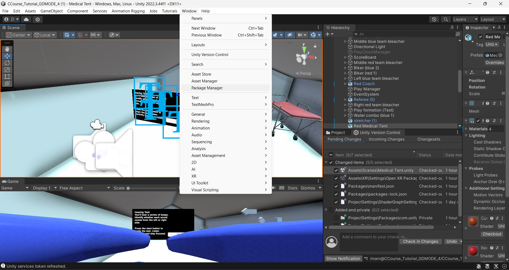
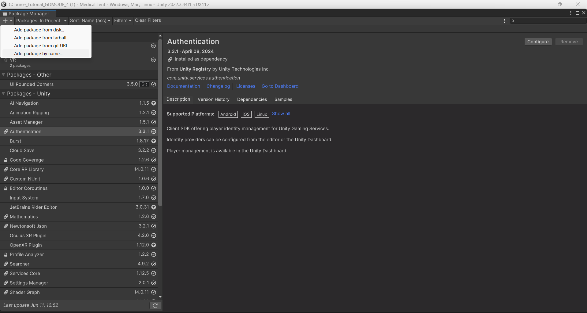
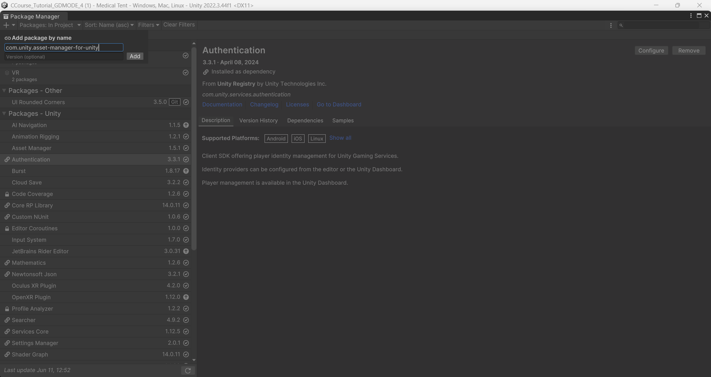
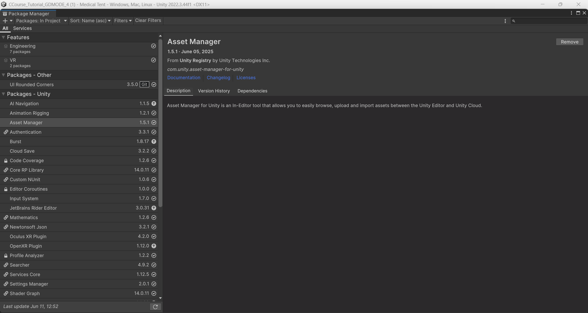
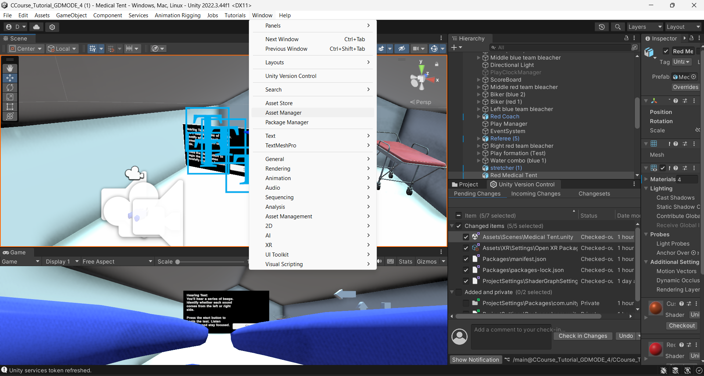
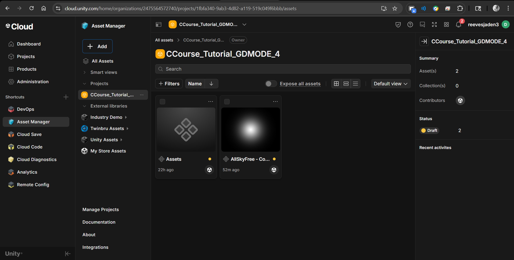
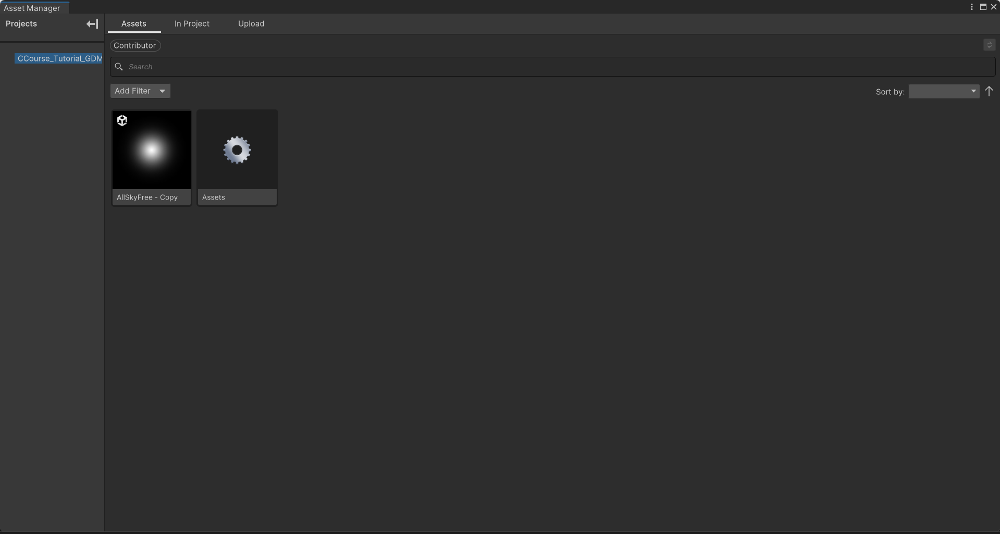

# ☁️ Unity Cloud Services Setup & Guide

> ⚠️ **Editor Compatibility Notice**  
> The ability to follow the steps in this README may vary depending on the version of the Unity Editor being used.  
> Before utilizing this guide, your development team must **agree on a specific Unity version** to ensure consistency and avoid compatibility issues.  
> Features and workflows may differ across versions. This Readme was focused on unity **2022.3.44f1 LTS** and **6000.0.50f1 LTS**

**Author:** Daniel Onyejiekwe  
**Date:** June 2025

This document provides a comprehensive overview and setup guide for Unity Cloud Services, including testing insights, troubleshooting, and best practices. It's written to help Unity developers streamline their workflow using Unity’s integrated cloud tools.

---

## 📌 Table of Contents

- [Overview](#overview)
- [Core Services Explained](#core-services-explained)
- [Setup Instructions](#setup-instructions)
- [Enable Version Control (Step 5)](#-enable-version-control-step-5)
- [Best Practices](#-best-practices)
- [Troubleshooting](#-troubleshooting)
- [Screenshots](#-screenshots)
- [Conclusion](#-conclusion)

---

## 🧠 Overview

Unity Cloud Services offer cloud-based tools to help developers build, deploy, and manage Unity projects with greater efficiency and collaboration. These services include automated builds, cloud saves, version control, and performance analytics.

---

## 🔍 Core Services Explained

### 🚀 Cloud Build  
Unity Cloud Build automates game builds for multiple platforms. After pushing changes to your repository, Unity Cloud compiles your game remotely and notifies you when it’s done.

### 💾 Cloud Save  
Allows developers to store and sync user data (like game progress or settings) to the cloud across multiple devices.

### 🧩 Unity DevOps  
**Version Control (Plastic SCM)** and **Build Automation** enable teams to collaborate in real-time and ship code with confidence.

### 📊 Cloud Diagnostics and Analytics  
Offers real-time insights into player behavior and automated crash reporting.

---

## ⚙️ Setup Instructions

### Step 1: Create Unity Project  
1. Open Unity Hub. 

   

2. Click **New Project**, choose a 2D or 3D template.

   

  *make sure to enable "Use Unity Version Control" as well as "Respository details" and name your project repository*  
3. Name it (e.g., `UnityCloudDemo`) and click **Create**.

### Step 2: Activate Unity Services  
1. In Unity, go to `Window > Services`.
   (Beware the in ***Unity Editor version 2022.3.44F1 LTS*** the order of events is 'Window > general >')
2. Sign in and create a Project ID if needed.  
3. Enable:  
   - Cloud Build  
   - Cloud Save  
   - Cloud Diagnostics  
   - Analytics  

### Step 3: Configure Cloud Build  
1. Visit [Unity Cloud Dashboard](https://cloud.unity.com/build). 

    

2. Link your Unity project and connect your GitHub/GitLab repo.  
3. Create a build target (e.g., Android, WebGL).  
4. Set build triggers (e.g., on every push to `main`).

### Step 4: Set Up Cloud Save  
1. In Unity, go to `Window > Services > Cloud Save`. 

   (*Beware the current version of Unity in use might change the order of operations in order to complete this process for example in Unity **2022.3.44f1 LTS** services is located in window > general > services*)
2. Enable the service.  
3. Example test code:
   ```csharp
   using Unity.Services.CloudSave;
   await CloudSaveService.Instance.Data.ForceSaveAsync();

## 🔐 Enable Version Control (Step 5)

### (Preferred) Option A: Plastic SCM

**Here is a comprehensive 5 minute video starter guide on how to use and what is Unity Version Control (Plastic SCM)**

[](https://www.youtube.com/watch?v=CUdB_otP41Y)

## 🗃️ Getting Started with Unity Version Control

**Here is an official in depth 17 minute video guide on how to use Unity Version Control (Plastic SCM)**

[](https://www.youtube.com/watch?v=9IvXupmgl88)

Get an introduction to version control in Unity, how to set up your own repository, invite collaborators, and check in changes. 

Unity Version Control (previously called Plastic SCM) is part of Unity DevOps which provides robust version control and CI/CD solutions in the Unity Cloud, so that you can release more often, catch bugs earlier, try more ideas, and deliver high-quality games. 

Read the Ebook: https://unity.com/resources/best-prac... 

Unity Version Control is available as a part of every Unity subscription. Visit https://unity.com/solutions/version-c... to get started today!

Please note the prices and terms mentioned in the video apply for the time of the recording and may be subject to change. For more info on pricing visit  https://unity.com/products/compare-pl... 

<details>
  <summary>⏱️ Time Stamps (click to expand)</summary>

  - **0:00** – Intro  
  - **0:41** – Project setup  
  - **2:09** – Check in changes  
  - **2:54** – Gluon  
  - **4:50** – Invite team members  
  - **5:53** – Branching strategies  
  - **7:46** – Branches  
  - **9:42** – Handling conflicts  
  - **11:27** – Merge rules  
  - **13:25** – Locking files  
  - **14:55** – Monitor usage  
  - **16:33** – Deleting repositories  

</details>

Correction: When you want to delete a repository in Unity The repositories are deleted after 7 days, not 10 days as mentioned in the video.

- When you delete a Unity Cloud (Plastic SCM) repository, it is actually unlinked immediately, but the underlying database is kept around for one week (7 days) 

- This 7-day grace period allows for recovery if deletion was accidental.

- Note that logs related to that repository may still persist for up to two weeks .

---
1. Go to **Unity Dashboard > DevOps > Version Control**.

   

2. Create or link an organization.  

   

3. Install the Unity Version Control plugin (Plastic SCM).

---
# 📂 Plastic SCM vs Gluon - Unity Version Control

This section explains the difference between **Plastic SCM** and **Gluon**, the two version control interfaces available through Unity’s Plastic SCM system.

***Note you can search for "Plastic SCM" and "Gluon" in your windows application panel to find these applications on your device after you have installed and enabled Unity Version Control or Plastic SCM from the editor***

---

## 🔍 Overview

Unity offers two interfaces for using version control:

- **Plastic SCM (Full Interface)** – designed for programmers and advanced users
- **Gluon** – designed for artists and non-technical team members

Both tools help you manage changes to your Unity project, but they work differently based on your role and workflow needs.

---

## 🧰 Comparison Table

| Feature | **Plastic SCM (Full Interface)** | **Gluon (Simplified Interface)** |
|--------|----------------------------------|----------------------------------|
| **Target Users** | Developers & advanced users | Artists, designers, non-tech team members |
| **Complexity** | Advanced & powerful | Easy & beginner-friendly |
| **Workflow** | Branch-based, full version control | File-based, simple change tracking |
| **Branching Support** | ✅ Full branching & merging | ❌ Limited (not user-accessible) |
| **Conflict Resolution** | Manual merge tools, full control | Basic auto-merge or overwrite |
| **Partial Checkout** | ✅ Yes (choose specific folders/files) | ✅ Yes (main focus of Gluon) |
| **Interface Style** | Technical UI (like Git clients) | Visual, drag-and-drop UI |
| **Scene Merge** | ✅ Yes (merge scenes with tools) | ⚠️ Not recommended (limited control) |

---

## 🧠 Summary

- **Plastic SCM** is best for:
  - Programmers and technical team members
  - Projects with complex branching, merging, or lots of code
  - Advanced control over version history

- **Gluon** is best for:
  - Artists and designers working on assets
  - Teams that want a simple workflow with fewer conflicts
  - Users who prefer not to deal with branches or merges

---

## ✅ Recommendation

| Role | Recommended Tool |
|------|------------------|
| Programmer | **Plastic SCM** |
| Artist / Designer | **Gluon** |
| Mixed Role | **Plastic SCM** (for full control) |

---

## 📎 Additional Notes

- Both Plastic SCM and Gluon work with Unity projects and can connect to the same cloud repository.
- You can mix usage in the team—developers use Plastic, artists use Gluon—as long as coordination is maintained.

---

Happy collaborating! 🔧🎨

---

### Option B: Git

1. Use your Git provider (e.g., GitHub, GitLab).  
2. Add a `.gitignore` file to exclude the following folders:

    ```
    Library/
    Temp/
    Builds/
    ```

---
## 📤 How to Share a Unity Project with Someone (2025)

**Here is a video on to share a unity project with someone**

   [](https://www.youtube.com/watch?v=GzLKfbch3oU)

---
## 💡 Best Practices

- ✅ Always enable **Collaborators** in your Unity Organization settings.  
- ✅ Use **environment variables** in build scripts for secrets and API keys.  
- ✅ Test **Cloud Save** functionality using development builds first.  
- ✅ Separate build targets for **staging** and **production** environments.  
- ✅ Regularly monitor **Cloud Diagnostics** for crash patterns.
- ✅ **Warning** Uploading large number of files through the web can be risky. The recommended best practice is to limit your web upload to 500 files max with a 20GB limit only. Alternatively, upload using Unity Version Control and then index your files.

---

## 🚀 Recommended Unity Services & Shortcuts

Here's a list of essential Unity services we recommend enabling for cloud-connected and scalable projects. These links go directly to the relevant Unity dashboards or documentation for faster access.

| Tool / Service     | Shortcut / Documentation Link                                                                 | Purpose                                                                 |
|--------------------|--------------------------------------------------------------------------------------------|-------------------------------------------------------------------------|
| 🎒 **Asset Manager**   | [Unity Asset Manager](https://docs.unity.com/en-us/cloud/asset-manager) *(navigate to your project → Assets)* | Manage uploaded assets, textures, models, and more                      |
| ☁️ **Cloud Diagnostics** | [Cloud Diagnostics](https://docs.unity.com/ugs/en-us/manual/cloud-diagnostics/manual/UserReporting/SettingupUserReporting)                    | Track crashes, exceptions, and player issues                            |
| 📈 **Analytics**        | [Unity Analytics Dashboard](https://docs.unity.com/ugs/manual/analytics/manual/overview)                         | Understand player behavior, retention, and in-game metrics              |
| 🧠 **Cloud Code**       | [Cloud Code](https://docs.unity.com/ugs/manual/cloud-code/manual/scripts/getting-started)                                    | Run server-side game logic without managing a backend                   |
| ⚙️ **Remote Config**    | [Remote Config](https://dashboard.unity3d.com/remote-config)                              | Change game settings without pushing new builds                         |
| 💾 **Cloud Save**       | [Cloud Save](https://docs.unity.com/ugs/en-us/manual/cloud-save/manual)                                    | Save and sync player progress across devices                            |

> 🔒 **Tip:** Make sure your Unity project is linked to a Unity organization and that you're signed in to view these services in the dashboard.

*Click the + icon to add shortcuts to any essential unity services*

   

---

## ☁️ 6. Unity Cloud Asset Manager

**Unity Cloud Asset Manager** is a cloud-based service provided by Unity to help teams **centralize, organize, and share game assets** across multiple projects and users. It lives in the Unity Cloud Dashboard and is designed to streamline collaboration between developers, artists, and designers.

---

### 🧾 What Is Unity Cloud Asset Manager?

Unity Cloud Asset Manager is part of Unity's growing suite of **cloud services** designed to support team workflows outside the Unity Editor.

This service allows teams to:

- Store and access assets **in the cloud**
- Maintain a **shared asset library**
- Collaborate on game development by **reusing assets across projects**
- Manage and preview assets without needing the Unity Editor
- Control who has access to each asset or folder (role-based permissions)

You can find it by logging into [Unity Dashboard](https://dashboard.unity3d.com), then navigating to **Asset Manager** under your Organization.

---

### ✅ What Does It Offer?

| Feature | Description |
|--------|-------------|
| 📁 **Cloud Asset Storage** | Securely store your models, textures, prefabs, audio, animations, and more |
| 🧩 **Cross-Project Sharing** | Use assets across multiple Unity projects without duplication |
| 👥 **Team Collaboration** | Designers and developers can upload and retrieve shared assets anytime |
| 🔍 **Search & Tagging** | Filter by name, type, tags, or metadata to quickly find what you need |
| 👀 **In-Browser Previews** | View 2D/3D asset previews and info directly in the Unity Dashboard |
| 🔐 **Permissions Control** | Control who can view, upload, or edit assets at the organization or project level |
| 🌐 **Web-Based Access** | No Unity Editor required to manage assets — access from any browser |

---

### 🚀 How to Use Unity Cloud Asset Manager

1. **Access It**  
   - Visit: [https://dashboard.unity3d.com](https://dashboard.unity3d.com)  
   - Go to your **Organization > Asset Manager**

2. **Upload Assets**  
   - Click **Upload** or drag-and-drop files  
   - Add names, tags, and folders to organize your library

3. **Organize Assets**  
   - Use folders and collections to sort by project, scene, asset type, etc.  
   - Add metadata like asset type, usage rights, or project purpose

4. **Import Assets Into Unity**  
   - Inside Unity, open **Package Manager** and install “Asset Manager” (if needed)  
   - Go to **Window > Asset Manager**  
   - Browse your cloud library and **import assets directly** into your project

---

### 🧠 Why Use Unity Cloud Asset Manager?

- 🚫 No more duplicate assets across team members’ local machines
- ⏱️ Save time by avoiding repeated exports/imports
- 🔄 Build a **shared asset pipeline** that works across projects
- 🔐 Control asset access while collaborating securely
- 🌍 Great for remote or distributed teams working in different Unity versions or setups

---

### 📝 Pro Tip

Use Unity Cloud Asset Manager alongside **Plastic SCM or Gluon** for version control. Plastic handles scene/code collaboration, while Asset Manager centralizes your reusable assets and keeps them accessible across all Unity projects.

---

## 📦 Package Installation: Unity Cloud Asset Manager

[Package Installation Documentation](https://docs.unity3d.com/Packages/com.unity.asset-manager-for-unity@1.5/manual/installation.html)
This section explains how to install the **Asset Manager for Unity** package.

> ⚠️ **Important:** Make sure you meet all [prerequisites](https://docs.unity3d.com/Packages/com.unity.asset-manager-for-unity@1.5/manual/prerequisites.html) before installation.

---

### ✅ For Unity Editor 2022.3.51f1, 6000.0.23f1, and Later

1. Open **Unity Hub**.
2. Sign in with your **Unity ID**.
3. Open your Unity project.
4. In the top menu bar, go to:  
   `Window > Package Manager`
5. In the top-left corner of the Package Manager window:
   - Click the dropdown labeled **Packages: In Project**
   - Select **Unity Registry**
6. Under the **Services** tab:
   - Scroll down and select **Asset Manager** under **Content Management**
7. Click the **Install** button in the top-right corner.
8. Once installed, the package details will appear on the right panel.

---

### 🕹️ For Older Versions of Unity (22LTS / 23LTS)

1. Open **Unity Hub**.
2. Sign in with your **Unity ID**.
3. Open a Unity project using a supported LTS version.
4. In the top menu bar, go to:  
   `Window > Package Manager`

      

5. In the Package Manager window:
   - Click the **Add (+)** button in the top-left
   - Select **Add package by name**

      

6. In the dialog that appears:
   - **Name:** `com.unity.asset-manager-for-unity`
   - Leave **Version** blank or specify if 
   
      

7. Click **Add**.
8. After installation, package details will appear in the right panel.

      

---

### 📂 Open the Asset Manager Window

After installation, you can open the Asset Manager panel in Unity by going to:  
`Window > Asset Manager`

 Asset Manager screenshot" width="800">

---

***Now you should be able to see and update all assets that are being used on a specific unity project through the Unity Cloud Asset Manager service in the Unity editor***

***Unity Cloud version of Asset Manager***



---
***Unity Editor version of Asset Manager (2022.3.44.F1 LTS)***



---
## 🧯 Troubleshooting

| Issue                     | Solution                                                        |
|---------------------------|-----------------------------------------------------------------|
| Builds not triggering      | Ensure correct Git branch is linked and push includes new changes |
| Cloud Save errors          | Check internet connection and ensure Unity Authentication is enabled |
| Version control conflict   | Use lock rules or communicate with team before overwriting shared assets |
| Cloud Build stuck at “queued” | Free plan may delay builds during peak times                  |
| File/path names being too long to cloud upload and check in changes | Make sure the file and path name of your unity project is structured well and uses good naming conventions to fix this issue for example shortening the name of your project name to ***"veryreallylongprojectnamehere"*** to ***"simplename"*** to not go over Unity's 200 character path name and file name limit when uploading and download changes in a project |
|An existing checkout operation has locked the workspace ***'Unity Project Name'***. Please wait for the checkout operation to finish. | This just means someone (or the system) is already in the middle of a checkout process in that workspace. Checkouts involve downloading and locking files, so Unity Version Control (Plastic SCM) prevents other actions until it's done — to avoid conflicts or file corruption. Sometimes, it just needs a moment to finish. If another teammate or a process is checking out files, give it a minute or two.

***File/path names being to long to cloud upload and check in changes***

   

## 🖼️ Screenshots


- Unity Dashboard showing Cloud Build targets  

    

- In-Editor Service Panel with Cloud Save enabled   

    

- Cloud Diagnostics console  
  
    

- Sample success build email notification  

   

---

## 💰 Pricing

Unity Cloud Services offer different plans depending on your project's scale and requirements. Here is a general overview:

- **Free Plan**  
  - Limited number of Cloud Build minutes per month  
  - Basic Cloud Save storage quota  
  - Access to core features with usage caps  
  - Suitable for small projects or individual developers  

- **Plus and Pro Plans**  
  - Increased build minutes and storage limits  
  - Priority build queues  
  - Advanced analytics and diagnostics  
  - Access to collaboration features with more users  
  - Ideal for teams and larger projects  

- **Enterprise Plans**  
  - Custom pricing based on scale and support needs  
  - Dedicated support and SLAs  
  - Advanced security and compliance options  

*In the context of Unity's Build Automation service, "build minutes" refer to the time your project spends being processed by Unity's cloud servers during a build. These minutes are used to calculate your billable usage and determine whether you are exceeding any allocated limits.* 

**Note:** Pricing and limits can change; always check the [official Unity Cloud pricing page](https://unity.com/products/compare-plans/unity-cloud?utm_source=chatgpt.com) for the latest details.

([Official Unity Cloud Documentation](https://docs.unity.com/en-us/cloud/billing/unity-cloud-pricing-model?utm_source=chatgpt.com))

Unity Cloud Services pricing varies by plan and usage. Below is an approximate summary:

## ☁️ Unity Cloud Plans (2025)

Unity Cloud offers multiple plans tailored to different team sizes and needs. These plans provide tools like Cloud Build, Cloud Save, Asset Manager, DevOps, and team collaboration features.

| Plan               | Price               |Assest Manager Storage         | Key Features                        | Bundled with other Unity Plans |
|--------------------|---------------------|------------------|------------------------------------------------------------|----------------------|
| **Personal**       | Free                | 10 GB/org        | For individuals or hobbyists. Basic tools, limited access. | Included in Unity Personal |
| **Pro**            | $60/seat/month      | 50 GB/seat       | Advanced collaboration, CI/CD, asset management.           | Included in Unity Pro |
| **Enterprise**     | $110/seat/month     | 120 GB/seat      | SLAs, premium support, enterprise-grade controls.          | Included in Enterprise and Industry |
| **Collaborate**    | $25/seat/month      |      N/A         | Add-on to Unity Enterprise, Unity Industry, or Unity Cloud Enterprise| 

*For extra storage on Unity Cloud, you can subscribe to a pay-as-you-go plan at $0.75 per GB per month.
In this example, your Unity Cloud organization has five subscriptions to Unity Cloud Pro. Each subscription includes 50 GB of storage. Members of your organization can upload content to Unity Asset Manager up to 250 GB.*

> **Note:** 
> - Additional build minutes and storage can be purchased as add-ons.  
> - Pricing may vary based on region and contract terms.  
> - Always refer to the official [Unity cloud Pricing Page](https://unity.com/products/compare-plans/unity-cloud?utm_source=chatgpt.com) for the most current info.


# 🎫 What Are Seats in Unity?

A **seat** refers to **a license assigned to one user** — like a “ticket” that gives someone access to Unity’s services and tools under a specific plan (Pro, Plus, Enterprise, etc.).

Think of it this way:

> 🧍‍♂️ One developer working on Unity needs **one seat**.  
> 👨‍👩‍👧‍👦 A team of 5 developers? You need **5 seats** — one for each user.

---

## 🧩 What Does a Seat Include?

When you assign someone a seat, they get:

- Access to the Unity Editor under the paid plan (Pro, Plus, etc.)
- Ability to use cloud services (like Build Automation, Remote Config, etc.)
- Permission to collaborate on Unity projects via version control
- Access to Unity’s dashboards, usage data, and APIs
- License to use certain Unity tools and plugins restricted to the paid tier

---

## 💼 Seat Assignment and Management

- You manage seats through the [Unity Dashboard](https://id.unity.com/organizations).
- Only an **Organization Owner or Manager** can assign/unassign seats.
- Seats can be reassigned to a different user, but **not shared simultaneously**.

---

### 💵 Seat Pricing (as of 2025)
| License Type     | Price per Seat (Annual) | Monthly Option |
|------------------|-------------------------|----------------|
| Unity Pro        | $2,200/year             | $200/month     |
| Unity Industry   | $4,950/year             | $450/month     |
| Unity Enterprise | Custom pricing          | Custom pricing |
| Unity Personal   | Free (limited features) | Free (limited features)|

> **Example:** A 3-person team using Unity Pro would pay:  
> **3 seats × $200/month = $600/month** or **$7,200/year**

---

## 🛠️ Summary

| **Term**     | **Meaning**                                      |
|--------------|--------------------------------------------------|
| **Seat**     | A license assigned to one team member            |
| **Why it matters** | Determines who can use paid features and cloud tools |
| **1 user = 1 seat** | You cannot share seats simultaneously between users |

---

# 🎮 Unity Team Project - Merging Multiple Scenes

This guide explains how to merge multiple Unity scenes from different team members (in separate projects) into one central Unity project.

---

## ✅ Overview

Each team member has been working on a different scene in their own Unity project. The goal is to combine all scenes into a single Unity project without losing any assets or functionality.

---

## 🔁 1. Choose a Main Project

Designate one Unity project to be the **main/central project** where all scenes and assets will be merged.

---

## 📦 2. Export Scenes from Other Projects

For each teammate's Unity project:

1. Open the Unity project containing your scene.
2. In the **Project window**, locate the folder containing:
   - Your `.unity` scene file
   - Any models, textures, prefabs, scripts used in the scene
3. Right-click the folder ➜ Select **Export Package…**
4. In the export window, check **"Include Dependencies"**
5. Click **Export** and save the `.unitypackage` file

---

## 💻 3. Import Packages into the Main Project

In the main Unity project:

1. Open the project in Unity
2. Right-click in the **Project window** ➜ Select **Import Package > Custom Package…**
3. Choose the `.unitypackage` file from a teammate
4. Import all assets when prompted
5. Repeat for all teammates' scenes

---

## 🧹 4. Organize and Rename

After importing:

- Rename each scene clearly (e.g., `LockerRoom.unity`, `MainMenu.unity`, etc.)
- Store all scenes in `Assets/Scenes/TeamScenes/` or a similar directory

---

## 🔄 5. Scene Navigation (Optional)

To switch between scenes in the game:

Use Unity’s built-in scene manager. Example:

<div style="max-width: 600px; overflow-x: auto;">

<pre><code>
using UnityEngine;
using UnityEngine.SceneManagement;

public class SceneSwitcher : MonoBehaviour
{
    public void LoadScene(string sceneName)
    {
        SceneManager.LoadScene(sceneName);
    }
}
</code></pre>

</div>

---
## 🧾 Conclusion

Unity Cloud Services simplify development workflows by handling builds, syncing data, and managing version control through a unified interface. Based on testing, the setup process is straightforward, but some services may require additional permissions or API calls.